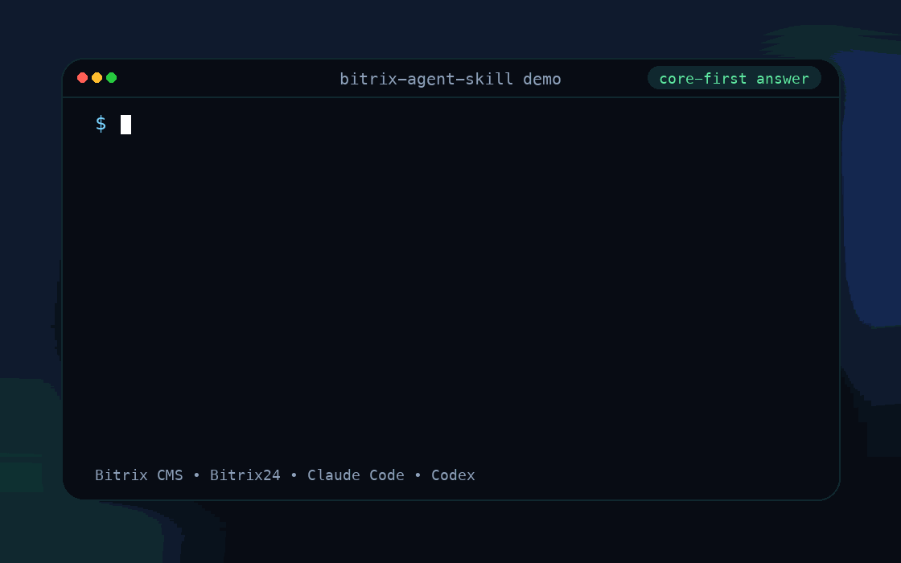

# Bitrix Agent Skill

<p align="center">
  <strong>Эксперт по 1C-Bitrix для Claude Code и Codex с принципом «сначала ядро».</strong><br />
  Навык содержит проверенную базу знаний по ядру Bitrix и правила работы с проектом: если агенту доступна рабочая копия проекта, он должен сверять ответ с `www/bitrix`, стандартными компонентами, шаблонами и `local/*`-оверрайдами.
</p>

<p align="center">
  <a href="https://github.com/Poliklot/bitrix-agent-skill/releases/latest">Последний релиз</a>
  · <a href="LICENSE">Лицензия MIT</a>
  · <a href="https://github.com/Poliklot/bitrix-agent-skill/tree/master/mcpmarket/bitrix">Папка для MCP Market</a>
</p>

<p align="center">
  
</p>

## Зачем это нужно

Bitrix-проекты нельзя нормально вести “по памяти”. В каждом проекте отличаются состав модулей, скопированные шаблоны компонентов, wizard-ассеты, старые пути записи, настройки и `local/*`-оверрайды.

Этот навык помогает агенту работать как опытный Bitrix-разработчик:

- не применять справочник вслепую к проекту с другим набором модулей;
- при доступе к файлам проекта проверять наличие модулей, `version.php`, стандартные компоненты и шаблоны;
- читать стандартные компоненты и шаблоны перед тем, как советовать правку;
- разделять D7, старый `C*` API и пути записи с важными побочными эффектами;
- считать `catalog`, `sale`, `currency`, `bizproc`, `pull`, 1С и магазинные интеграции условными, пока они не подтверждены в конкретном проекте;
- не путать аудит по коду ядра с проверкой в живом окружении.

## Что значит «сначала ядро»

Навык не сканирует Bitrix сам по себе. Это набор инструкций и справочных файлов для агента. Поведение зависит от контекста:

| Ситуация | Как должен работать агент |
|---|---|
| Есть доступ к рабочей копии проекта | Проверить `www/bitrix/modules`, версии модулей, стандартные компоненты, шаблоны и `local/*`, затем применять справочник. |
| Доступа к проекту нет | Использовать проверенную базу знаний навыка, но явно сказать, что локальный модуль/версия/оверрайд не проверены. |
| Версия модуля отличается от описанной в справочнике | Считать справочник ориентиром, а источник истины — локальный код этого модуля. |

Версии в справочниках нужны не для магического выбора поведения по всем релизам Bitrix. Они фиксируют, по какому ядру проверен конкретный контракт: например, shop-core содержит `catalog` 25.550.0, `sale` 26.0.0, `currency` 26.0.0. Если в клиентском проекте версия другая, агент должен не угадывать совместимость, а читать локальные файлы модуля.

## Установка

### macOS / Linux

```bash
curl -fsSL https://raw.githubusercontent.com/Poliklot/bitrix-agent-skill/master/install.sh | bash
```

### Windows PowerShell

```powershell
irm https://raw.githubusercontent.com/Poliklot/bitrix-agent-skill/master/install.ps1 | iex
```

Если навык не появился сразу, один раз перезапустите Claude Code или Codex.

В Bitrix-проекте вызывайте:

```text
/bitrix почему товар есть в админке, но не виден на сайте?
```

### MCP Market

В MCP Market есть лимит 50 файлов на импортируемую папку. Используйте компактную версию только для чтения:

```text
https://github.com/Poliklot/bitrix-agent-skill/tree/master/mcpmarket/bitrix
```

Полная папка `bitrix/` содержит скрипты установки/обновления/удаления и 77 отдельных справочных файлов. Версия `mcpmarket/bitrix/` содержит тот же справочный слой, но сгруппированный в компактные пакеты.

<details>
<summary>Расширенные варианты установки</summary>

Установить навык только в нужный контур:

```bash
curl -fsSL https://raw.githubusercontent.com/Poliklot/bitrix-agent-skill/master/install.sh | bash -s -- --claude
curl -fsSL https://raw.githubusercontent.com/Poliklot/bitrix-agent-skill/master/install.sh | bash -s -- --codex
curl -fsSL https://raw.githubusercontent.com/Poliklot/bitrix-agent-skill/master/install.sh | bash -s -- --both
```

Установить конкретную версию:

```bash
curl -fsSL https://raw.githubusercontent.com/Poliklot/bitrix-agent-skill/master/install.sh | bash -s -- --version 1.25.0 --claude
```

То же самое для PowerShell:

```powershell
& ([scriptblock]::Create((irm https://raw.githubusercontent.com/Poliklot/bitrix-agent-skill/master/install.ps1))) -Claude
& ([scriptblock]::Create((irm https://raw.githubusercontent.com/Poliklot/bitrix-agent-skill/master/install.ps1))) -Codex
& ([scriptblock]::Create((irm https://raw.githubusercontent.com/Poliklot/bitrix-agent-skill/master/install.ps1))) -Both
& ([scriptblock]::Create((irm https://raw.githubusercontent.com/Poliklot/bitrix-agent-skill/master/install.ps1))) -Version 1.25.0 -Claude
```

</details>

## Что покрывает

| Область | С чем помогает навык |
|---|---|
| Ядро и модули | `main`, `iblock`, ORM, Loader, события, слой БД, сессии, RBAC, кеш, пошаговые процессы |
| Компоненты и шаблоны | контракты стандартных компонентов, скопированные шаблоны, `result_modifier.php`, `component_epilog.php`, AJAX, пагинация |
| Контент | инфоблоки, HL-блоки, UF, формы, блог, форум, опросы, landing, fileman, поиск, SEO |
| Интернет-магазин | `catalog`, `sale`, `currency`, SKU/торговые предложения, цены, остатки, корзина, оформление заказа, заказы, оплаты, доставка, скидки |
| 1С / CommerceML | `catalog.import.1c`, `catalog.export.1c`, `sale.export.1c`, XML_ID/CML2_LINK, логи обмена и тестовые данные |
| Интеграции | REST, вебхуки, права приложений, `webservice.sale`, `webservice.statistic`, SOAP/WSDL, Bitrix24 connector |
| Продакшен-разработка | кастомизация, безопасная для обновлений, выбор D7 или старого API, матрица подводных камней, план проверки в живом окружении |
| Эксплуатация | миграции, agents/cron, пошаговые процессы, импорты, резервное копирование, мониторинг, диагностика производительности |

Магазинный маршрут включается в каждом проекте отдельно — только после проверки нужных модулей в `www/bitrix/modules`, если рабочая копия доступна агенту. Отдельная база shop-core описывает 49 модулей, но это не отменяет локальную проверку клиентского проекта.

## Примеры запросов

```text
/bitrix Проверь по core, почему вторая страница каталога пустая после фильтра
/bitrix Разбери, почему 1С выгрузила товар, но на сайте нет цены и остатка
/bitrix Найди слой стандартного шаблона для form и объясни intranet-вариант
/bitrix Сформируй безопасный для продакшена план доработки оформление заказа и перечисли грабли
/bitrix Проверь, можно ли в этом проекте идти в sale/catalog, или магазинный маршрут пока отложен
/bitrix Почему REST событие заказа не прилетело во внешний вебхук?
```

## Как устроено

Навык использует постепенную загрузку контекста:

```text
bitrix-agent-skill/
├── bitrix/SKILL.md              # точка входа, маршрутизация, правила безопасности
├── bitrix/references/*.md       # 77 узких справочников, загружаются только по необходимости
├── mcpmarket/bitrix/            # компактная версия для MCP Market, только для чтения
├── install.sh / install.ps1     # установщики для Claude Code и Codex
└── CHANGELOG.md / PLAN.md       # история релизов и план аудита
```

Агент начинает с `bitrix/SKILL.md`, определяет домен задачи и загружает только нужные справочные файлы. Он не должен тащить всю Bitrix-базу знаний в контекст на каждый запрос.

## Правила безопасности

Навык намеренно консервативный:

- не выдумывает API, события, классы и параметры компонентов;
- не включает магазинный маршрут без локального подтверждения `catalog` / `sale` / `currency`;
- не правит прямым SQL заказы, корзины, оплаты, отгрузки, цены и остатки, если важны побочные эффекты API;
- не использует продакшен-1С, реальные платежи, доставку, кассы, SMS или клиентские данные для проверки без явного подтверждения;
- не заявляет, что проверка в живом окружении пройдена, без песочницы, тестовых данных и зафиксированных доказательств.

## Обновление и сопровождение

Установленный навык умеет проверять GitHub-релизы и обновляться.

```bash
bash ~/.claude/skills/bitrix/update.sh --check
bash ~/.claude/skills/bitrix/update.sh

bash "${CODEX_HOME:-$HOME/.codex}/skills/bitrix/update.sh" --check
bash "${CODEX_HOME:-$HOME/.codex}/skills/bitrix/update.sh"
```

```powershell
powershell -ExecutionPolicy Bypass -File "$HOME\.claude\skills\bitrix\update.ps1" -Check
powershell -ExecutionPolicy Bypass -File "$HOME\.claude\skills\bitrix\update.ps1"

$CodexHome = if ($env:CODEX_HOME) { $env:CODEX_HOME } else { Join-Path $HOME '.codex' }
powershell -ExecutionPolicy Bypass -File (Join-Path (Join-Path $CodexHome 'skills') 'bitrix\update.ps1') -Check
powershell -ExecutionPolicy Bypass -File (Join-Path (Join-Path $CodexHome 'skills') 'bitrix\update.ps1')
```

При первом содержательном запросе `/bitrix` навык должен молча выполнить `--check`. Если есть новая версия, он должен сказать строго так:

```text
Обновилась версия скилла с X до Y. Давай обновим?
```

<details>
<summary>Команды для списка версий и удаления</summary>

```bash
bash ~/.claude/skills/bitrix/versions.sh
bash "${CODEX_HOME:-$HOME/.codex}/skills/bitrix/versions.sh"

bash ~/.claude/skills/bitrix/uninstall.sh
bash "${CODEX_HOME:-$HOME/.codex}/skills/bitrix/uninstall.sh"
```

```powershell
powershell -ExecutionPolicy Bypass -File "$HOME\.claude\skills\bitrix\versions.ps1"
powershell -ExecutionPolicy Bypass -File "$HOME\.claude\skills\bitrix\uninstall.ps1"

$CodexHome = if ($env:CODEX_HOME) { $env:CODEX_HOME } else { Join-Path $HOME '.codex' }
powershell -ExecutionPolicy Bypass -File (Join-Path (Join-Path $CodexHome 'skills') 'bitrix\versions.ps1')
powershell -ExecutionPolicy Bypass -File (Join-Path (Join-Path $CodexHome 'skills') 'bitrix\uninstall.ps1')
```

</details>

## Требования

- Claude Code или Codex
- проект на 1C-Bitrix CMS или коробочном ядре Bitrix24

## Обратная связь

Issues и PR приветствуются, особенно если вы приносите новый кейс из реального Bitrix-проекта, проверенный по ядру.

Если навык сэкономил вам время, поставьте звезду репозиторию — это самый понятный сигнал, что Bitrix заслуживает нормального инструменты для агентов.

## Лицензия

MIT. Подробности в [LICENSE](LICENSE).
